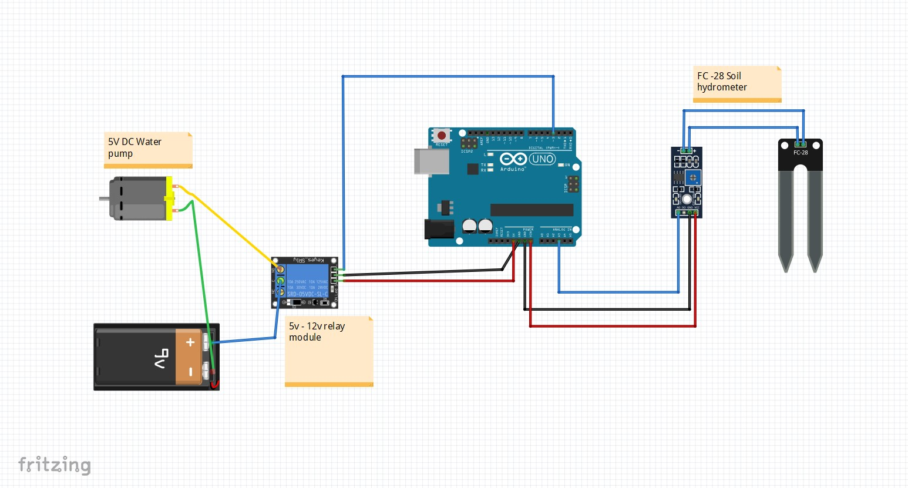

# Irrigation-system
The aim of the project is to irrigate  plants through  automation. I used Arduino as a stack and FC-28 hydrometer to measure the water content in the soil. I programmed the Arduino Uno board in such a way that if the moisture decreases, automatically the water pump turns on, obviously the water flows and keep the plants from drying.
 They could be used especially in farming land to maintain the quality of crops.
 
 
 
 
 
